<table>
  <tr>
    <td width="150" align="center" valign="middle">
      
    </td>
    <td valign="top">
      <p><strong>Universiteti i Prishtinës</strong></p>
      <p>Fakulteti i Inxhinierisë Elektrike dhe Kompjuterike</p>
      <p>Inxhinieri Kompjuterike dhe Softuerike - Programi Master</p>
      <p><strong>Lënda:</strong> Machine Learning</p>
      <p><strong>Profesorët:</strong> Prof. Dr. Lule Ahmedi dhe Dr. Sc. Mërgim Hoti</p>
      <p><strong>Studentët (Gr. 3):</strong></p>
      <ul>
        <li>Enis Hoxha</li>
        <li>Fisnik Hazrolli</li>
        <li>Endri Binaku</li>
      </ul>
    </td>
  </tr>
</table>

# Trajnimi i modelit per parashikimin e rritjes se te ardhurave te bizneseve ne Kosove

Ky projekt paraqet një pipeline të ndërtuar në Python për ingestimin, pastrimin, profilizimin, agregimin, kampionimin, detektimin e outliers dhe analizën e imbalance për datasetin `Qarkullimi.xlsx`.

## Përshkrimi i Projektit

Qëllimi i projektit është përgatitja e një dataseti të përdorshëm për analiza të mëtejshme dhe modelim në kuadër të lëndës Machine Learning. Procesi fokusohet në:

- leximin dhe normalizimin e të dhënave nga Excel
- pastrimin dhe validimin e kolonave kryesore
- profilizimin para dhe pas pastrimit
- agregimin dhe kampionimin e të dhënave
- detektimin e outliers dhe analizën e imbalance
- gjenerimin e raporteve dhe grafikëve përmbledhës

## Të Dhënat

Dataseti kryesor i përdorur në projekt është:

- `Faza 1/dataset/Qarkullimi.xlsx`

Burimi i të dhënave:

- [ATK Open Data](https://www.atk-ks.org/en/open-data/)

Karakteristikat kryesore të datasetit:

- madhësia fillestare: `753,891` rreshta dhe `7` kolona
- formati burimor: Excel
- rreshti i header-it: rreshti `9`
- fokusi kryesor aktual: dataseti bazë
- zgjerim i mundshëm: datasetet vjetore në `Faza 1/2019-2025/`

### Kolonat Kryesore

Kolonat kanonike të përdorura nga pipeline-i janë:

- `year`
- `month`
- `primary_sector`
- `municipality`
- `registration_status`
- `num_taxpayers`
- `turnover_eur`

## Struktura e Projektit

```text
group-3-machine-learning/
├── README.md
├── Faza 1/
│   ├── README.md
│   ├── requirements.txt
│   ├── dataset/
│   │   └── Qarkullimi.xlsx
│   ├── 2019-2025/
│   │   └── Qarkullimi-*.xlsx
│   ├── data/
│   ├── docs/
│   │   └── steps/
│   ├── notebooks/
│   ├── outputs/
│   │   ├── aggregate/
│   │   ├── clean/
│   │   ├── imbalance/
│   │   ├── ingest/
│   │   ├── outliers/
│   │   ├── profile/
│   │   ├── report/
│   │   └── sample/
│   ├── src/
│   └── tests/
└── .gitignore
```

## Pipeline i Përpunimit të të Dhënave

1. `profile_raw`
2. `ingest`
3. `clean`
4. `profile`
5. `aggregate`
6. `sample`
7. `outliers`
8. `imbalance`
9. `resample` (opsionale)
10. `report`

| Hapi | Përshkrimi |
|------|------------|
| `profile_raw` | Profilizimi fillestar i datasetit bruto para çdo transformimi |
| `ingest` | Nxjerrja dhe normalizimi i të dhënave nga Excel |
| `clean` | Pastrimi strikt dhe përgatitja e datasetit për analizë |
| `profile` | Profilizimi i datasetit pas pastrimit |
| `aggregate` | Krijimi i pamjeve të agreguara |
| `sample` | Kampionimi i të dhënave me opsione stratifikimi |
| `outliers` | Identifikimi dhe raportimi i outliers |
| `imbalance` | Analiza e shpërndarjes së klasave dhe imbalance |
| `resample` | Resampling me algoritme si SMOTE ose ADASYN |
| `report` | Gjenerimi i raportit final dhe grafikëve |

## Rezultatet Kryesore sipas Hapave

Ky seksion përmbledh rezultatet konkrete të gjeneruara nga pipeline-i bazuar në artefaktet aktuale të projektit.

### Hapi 0: `profile_raw`

- Dataseti fillestar përmban `753,891` rreshta dhe `7` kolona kanonike.
- U identifikua `1` rresht me vlera të munguara.
- U identifikuan `102,977` rreshta dublikatë.
- U identifikuan `176` raste me `turnover_eur` jo-valid.

Ky hap shërben si pika fillestare e analizës. Ai na tregon gjendjen reale të datasetit para se të bëhet ndonjë pastrim apo transformim.

### Hapi 1: `ingest`

- U lexua me sukses `Qarkullimi.xlsx` duke përdorur header-in në rreshtin `9`.
- U normalizuan kolonat në skemën standarde të pipeline-it: `year`, `month`, `primary_sector`, `municipality`, `registration_status`, `num_taxpayers`, `turnover_eur`.
- U krijuan dy output-e bazë: `Faza 1/outputs/ingest/raw_extract.csv` dhe `Faza 1/outputs/ingest/normalized.csv`.

Ky hap siguron që të gjitha skriptat e tjera të punojnë mbi të njëjtën strukturë standarde të të dhënave.

### Hapi 2: `clean`

- U largua `1` rresht bosh ose header i përsëritur.
- U larguan `102,977` dublikata.
- Dataseti i pastruar përfundoi me `650,913` rreshta dhe `7` kolona.
- U krijuan dy versione: `strict_cleaned.csv` për analizë të pastër dhe `model_ready.csv` për modelim.

**Veprimet kryesore të regjistruara në cleaning log:**

| Veprimi | Numri |
|---------|-------|
| `drop_empty_or_header_rows` | 1 |
| `drop_duplicates` | 102,977 |
| `standardize_text` në `primary_sector` | 753,890 |
| `standardize_text` në `municipality` | 753,890 |
| `standardize_text` në `registration_status` | 753,890 |

Ky hap largon zhurmën kryesore nga dataseti dhe krijon bazën që përdoret në të gjithë analizën pasuese.

### Hapi 3: `profile`

- Dataseti pas pastrimit ka `650,913` rreshta.
- Nuk ka më rreshta me vlera të munguara (`0`).
- Nuk ka më dublikata (`0`).
- Të gjitha `7` kolonat kryesore janë të përdorshme për analizë.

**Përmirësimi nga profili fillestar te profili pas pastrimit:**

| Metrika | Para pastrimit | Pas pastrimit |
|---------|----------------|---------------|
| Rreshta totale | 753,891 | 650,913 |
| Rreshta me null | 1 | 0 |
| Dublikata | 102,977 | 0 |
| Kolona | 7 | 7 |

**Grafiku i null values**

Ky grafik tregon numrin e vlerave që mungojnë për secilën kolonë pas pastrimit. Në rezultatet tona, të gjitha kolonat kryesore kanë `0` null values, që do të thotë se dataseti është i plotë për analizë të mëtejshme.


### Hapi 4: `aggregate`

Agregimet kryesore tregojnë shpërndarjen e qarkullimit sipas viteve, muajve, sektorëve dhe komunave.

**Qarkullimi sipas viteve**

| Viti | Qarkullimi total |
|------|------------------|
| 2025 | 23,811,372,168.39 |
| 2024 | 20,617,432,906.60 |
| 2023 | 20,324,288,747.31 |
| 2022 | 18,845,573,125.00 |
| 2021 | 15,400,266,531.77 |
| 2020 | 11,664,813,801.94 |
| 2019 | 12,383,222,505.53 |

**Top komunat sipas qarkullimit total**

| Komuna | Qarkullimi total |
|--------|------------------|
| PRISHTINË | 51,454,186,316.62 |
| GRAÇANICË | 12,001,136,718.54 |
| FERIZAJ | 8,042,949,524.07 |
| PRIZREN | 7,059,288,896.19 |
| PEJË | 5,792,950,085.84 |

**Top sektorët sipas qarkullimit total**

| Sektori | Qarkullimi total |
|---------|------------------|
| Tregtia me shumice dhe pakice; Riparimi i mjeteve motorike dhe motoeikletave | 58,454,594,520.41 |
| Industria perpunuese | 15,883,838,199.75 |
| Ndertimtaria | 11,493,086,507.21 |
| Furnizimi me rryme, gaz, avull dhe ajer te kondicionuar | 8,652,030,263.83 |
| Aktivitetet financiare dhe te sigurimit | 4,600,848,077.35 |

**Grafikët e agregimit**

Grafiku sipas viteve paraqet trendin e qarkullimit total në kohë. Nga rezultatet shihet se `2025` ka vlerën më të lartë totale në datasetin aktual.


Grafiku sipas muajve ndihmon të shihet sezonaliteti. Në të dhënat aktuale, muaji `12` ka qarkullimin total më të lartë.


Grafiku i komunave tregon komunat me peshën më të madhe ekonomike sipas qarkullimit. `PRISHTINË` dominon qartë ndaj komunave të tjera.


Grafiku i sektorëve tregon se cilët sektorë kontribuojnë më shumë në qarkullim. Sektori i tregtisë me shumicë dhe pakicë ka peshën më të madhe.


### Hapi 5: `sample`

- U krijua një kampion i rastësishëm me `1,000` rreshta.
- U krijua edhe një kampion i balancuar sipas `year_month` me `1,200` rreshta.
- Të dy kampionet përdorin `seed = 42`.
- U krijuan subset-e ndihmëse për `sector_focus`, `municipality_focus`, `registration_status_focus` dhe `monthly_time_pattern`.

Ky hap përdoret për eksplorim më të lehtë, testime të shpejta dhe për krijimin e subset-eve të fokusuara sipas dimensioneve kryesore të datasetit.

### Hapi 6: `outliers`

Outliers janë analizuar pa i fshirë nga dataseti kanonik.

| Metrika | Numri i rasteve |
|---------|-----------------|
| `turnover_eur_outlier_iqr` | 96,473 |
| `turnover_eur_outlier_zscore` | 5,455 |
| `num_taxpayers_outlier_iqr` | 79,451 |
| `num_taxpayers_outlier_zscore` | 8,101 |
| `turnover_eur_outlier_log_iqr` | 104,535 |

**Grafiku i outliers**

Ky grafik përmbledh sa raste ekstreme u zbuluan me secilën metodë. Ai tregon se `turnover_eur_log_iqr` dhe `turnover_eur_outlier_iqr` kapin më shumë vlera ekstreme sesa Z-score, gjë që është e pritshme për të dhëna financiare me shpërndarje të shtrembëruar.


### Hapi 7: `imbalance`

Analiza e imbalance tregon se klasa `registration_status` është e dominuar nga disa kategori kryesore.

**Top klasat për `registration_status`**

| Klasa | Numri | Pesha |
|-------|-------|-------|
| `SH.P.K.` | 321,710 | 49.4244% |
| `INDIVIDUAL` | 270,904 | 41.6191% |
| `ORTAKËRIA E PËRGJ.` | 17,491 | 2.6871% |
| `SHOQËRI AKCIONARE` | 11,642 | 1.7886% |
| `KOMPANI E HUAJ` | 11,218 | 1.7234% |

**Grafiku i shpërndarjes së klasave**

Ky grafik tregon pabarazinë mes klasave të `registration_status`. Dy klasat kryesore, `SH.P.K.` dhe `INDIVIDUAL`, zënë shumicën e datasetit, ndërsa klasat e tjera janë shumë më të vogla.


### Hapi 8: `resample`

- Është gjeneruar dataset i resampluar me SMOTE për `registration_status`.
- Para resampling, klasa më e madhe ishte `SH.P.K.` me `321,710` raste.
- Pas resampling, secila klasë është balancuar në `321,710` raste.
- Ky hap përdoret vetëm për eksperimente modelimi dhe jo si dataseti kanonik i pastruar.

**Çfarë bën SMOTE në këtë projekt**

SMOTE (`Synthetic Minority Over-sampling Technique`) krijon shembuj sintetikë për klasat e vogla, në vend që thjesht t'i kopjojë ato. Kjo bëhet që modeli i machine learning të mos mësojë vetëm klasat dominante si `SH.P.K.`, por të ketë mundësi të mësojë edhe klasat e rralla.

**Grafikët para dhe pas SMOTE**

Grafiku para SMOTE tregon pabarazinë e madhe mes klasave.


Grafiku pas SMOTE tregon se klasat janë sjellë në një shpërndarje të balancuar për trajnim.


### Hapi 9: `report`

- U gjenerua raporti final në `Faza 1/outputs/report/report.md`.
- U krijuan grafikë për qarkullimin sipas vitit, muajit, komunave, sektorëve, nulls, outliers dhe shpërndarjes së klasave.

Ky hap përmbledh gjithë pipeline-in në formë raporti dhe e bën projektin të gatshëm për prezantim.

## Konfigurimi

### Kërkesat

- Python 3.10+
- pandas
- numpy
- openpyxl
- matplotlib
- scikit-learn
- imbalanced-learn

Instalimi i varësive:

```bash
cd "Faza 1"
pip install -r requirements.txt
```

## Ekzekutimi i Projektit

Për të ekzekutuar pipeline-in e plotë:

```bash
cd "Faza 1"
python3 -m src.main --step all
```

Për të ekzekutuar hapa individualë:

```bash
cd "Faza 1"
python3 -m src.main --step profile_raw
python3 -m src.main --step ingest
python3 -m src.main --step clean
python3 -m src.main --step profile
python3 -m src.main --step aggregate
python3 -m src.main --step sample --sample-size 1200
python3 -m src.main --step sample --sample-size 5000 --stratify-by municipality
python3 -m src.main --step outliers
python3 -m src.main --step imbalance
python3 -m src.main --step report
python3 -m src.main --step resample --target-column registration_status --algorithm smote
```

## Output-et e Gjeneruara

Pipeline-i prodhon artefakte në folderin `Faza 1/outputs/`, duke përfshirë:

- `profile/before/`
- `profile/after/`
- `ingest/`
- `clean/`
- `aggregate/`
- `sample/`
- `outliers/`
- `imbalance/`
- `report/`

Disa prej skedarëve kryesorë të gjeneruar janë:

- `Faza 1/outputs/ingest/raw_extract.csv`
- `Faza 1/outputs/ingest/normalized.csv`
- `Faza 1/outputs/clean/strict_cleaned.csv`
- `Faza 1/outputs/clean/model_ready.csv`
- `Faza 1/outputs/clean/cleaning_log.csv`
- `Faza 1/outputs/clean/invalid_rows.csv`
- `Faza 1/outputs/report/report.md`

## Dokumentimi Shtesë

Për secilin hap të pipeline-it ekzistojnë dokumente të veçanta në:

- `Faza 1/docs/steps/`

README specifik i fazës gjendet në:

- `Faza 1/README.md`

## Shënime

- Kolonat Excel `A`, `E`, `F` dhe `I` anashkalohen sepse nuk përmbajnë të dhëna të dobishme për analizë.
- Kolonat bosh ndihmëse të Excel-it largohen gjatë ingestimit.
- Kampionimi në mënyrë standarde balancohet sipas `year_month`, përveç rasteve kur përcaktohet `--stratify-by`.
- Hapi `resample` është opsional dhe përdoret vetëm kur zgjidhet një kolonë target.
- Dataseti i pastruar kanonik nuk modifikohet nga eksperimentet opsionale të resampling-ut.

## Qëllimi Akademik

Ky projekt është realizuar si pjesë e lëndës Machine Learning dhe synon të demonstrojë zbatimin praktik të teknikave të parapërpunimit dhe përgatitjes së të dhënave për analiza statistikore dhe modelim të mëvonshëm.

---

## Faza 2: Analizë e Rritjes Ekonomike – Trajnimi, Evaluimi dhe Dokumentimi

### Qëllimi i Fazës 2

Faza 2 adresohet direkt pyetjes kryesore të projektit: **si ka performuar ekonomia e Kosovës sipas qytetit, sektorit, dhe kombinimit sektor × qytet në periudhën 2020–2025?**

### Struktura e Faza_2

```text
Faza_2/
├── requirements.txt
├── outputs/
│   ├── models/          # modelet e serializuara (.pkl)
│   ├── plots/           # grafikët e gjeneruar (.png)
│   └── metrics/         # raportet e metrikave (.csv)
└── src/
    ├── __init__.py
    ├── config.py          # konfigurim i centralizuar (rrugë, hiper-parametra)
    ├── data_loader.py     # ngarkimi dhe përgatitja e të dhënave
    ├── feature_engineering.py  # enkodimi i kategorive dhe skalimi
    ├── supervised.py      # Step A: Random Forest + XGBoost
    ├── unsupervised.py    # Step A: K-Means + PCA
    ├── evaluation.py      # Step B: metrika, grafikë dhe krahasime
    └── main.py            # pikë hyrëse CLI
```

### Algoritmet e Përdorura (7 gjithsej)

| # | Algoritmi | Lloji | Qëllimi                                                                  |
|---|-----------|-------|--------------------------------------------------------------------------|
| 1 | **Random Forest Classifier** | Supervised – Klasifikim | Klasifikon kombinimin (komunë, sektor) si GROWING / STABLE / DECLINING   |
| 2 | **XGBoost Classifier** | Supervised – Klasifikim | Alternativë gradient-boosting për klasifikim, shpesh me saktësi të lartë |
| 3 | **Linear Regression** | Supervised – Regresion | Baseline interpretues: parashikon vlerën e vazhdueshme të `growth_rate`  |
| 4 | **Random Forest Regressor** | Supervised – Regresion | Parashikon `growth_rate` me metodë ensemble jo-lineare                   |
| 5 | **XGBoost Regressor** | Supervised – Regresion | Modeli kryesor për parashikimet e tregut 2026                            |
| 6 | **K-Means Clustering** | Unsupervised | Grupimi i komunave dhe sektorëve sipas trajektores së rritjes            |
| 7 | **PCA** | Unsupervised | Reduktim dimensionaliteti dhe vizualizim                                 |

---

### Arsyetimi për zgjedhjen e algoritmeve

#### Algoritmet e Supervised Learning

**1. Random Forest Classifier**

Random Forest është zgjedhja kryesore për klasifikim për arsyet e mëposhtme:

- Dataseti ka tipare të përziera — numerike (`num_taxpayers`, `turnover_eur_log1p`) dhe kategorike të enkuduara (`primary_sector`, `municipality`). Random Forest i trajton këto tipare pa presupozime lineare.
- Të dhënat financiare të qarkullimit kanë shpërndarje të shtrembëruar me outliers të shumtë (96 473 me metodën IQR). Pylltë e rastësishme janë robuste ndaj vlerave ekstreme sepse vendimmarrja bazohet në ndarje, jo në distancë.
- Parametri `class_weight="balanced"` kompenson pabarazinë e klasave pa pasur nevojë të ngarkohet skedari i resampluar 603 MB.
- Ofron `feature_importances_` që tregon se cilat tipare — viti, muaji, sektori apo komuna — ndikojnë më shumë në klasifikimin e entitetit të regjistrimit.

**2. XGBoost Classifier**

XGBoost (Extreme Gradient Boosting) është plotësuesi natyral i Random Forest:

- Ndërsa Random Forest trajnon pemë paralelisht dhe i kombinon, XGBoost i ndërton pemë sekuencialisht duke korrigjuar gabimet e bëra nga modelet e mëparshme. Kjo strategji e boosting-ut zakonisht prodhon saktësi më të lartë në të dhëna tabulare.
- Regularizimi i integruar (L1 + L2) dhe `colsample_bytree=0.8` reduktojnë mbipërshtatjen (overfitting) në hapësirën e madhe të tipareve.
- Ofron `feature_importances_` të krahasueshme me ato të Random Forest, duke lejuar validimin e kross-metodave.
- Algoritmi është i optimizuar për memorie dhe CPU, i përshtatshëm për 50 000 rreshta me hiper-parametra konservativë.

#### Algoritmet e Supervised Learning – Regresion

**3. Linear Regression (OLS)**

- Shërben si benchmark minimal: nëse modelet e pemëve nuk e tejkalojnë një vijë të drejtë, sinjali jo-linear është i dobët.
- Koeficientët janë drejtpërdrejt të interpretueshëm: "+X% rritje për çdo njësi log-EUR qarkullimi paraprak."
- Nuk bën supozime mbi shpërndarjen e gabimeve në model; StandardScaler siguron peshim të drejtë të tipareve.

**4. Random Forest Regressor**

- E njëjta logjikë ensemble si klasifikuesi, por parashikon `growth_rate` si vlerë të vazhdueshme.
- Trajton ndërveprime jo-lineare midis komunës, sektorit dhe qarkullimit historik pa inxhinieri manuale tiparesh.
- Mesatarizimi ndër 300 pemë zvogëlon variancën, gjë kritike kur dataseti i agreguar ka vetëm 3 956 rreshta.

**5. XGBoost Regressor**

- Gradient boosting sekuencial me `objective=reg:squarederror` — optimizon MSE direkt.
- Regularizimi L1/L2 i integruar dhe `subsample=0.8` parandalojnë overfitting-un.
- Shërbeu si modeli kryesor për parashikimet e tregut 2026 falë saktësisë superiore të tij mbi të dhëna tabulare strukturore.

#### Algoritmet e Unsupervised Learning

**6. K-Means Clustering**

- Dataseti i qarkullimit ka grupime natyrale: pesë klasa kryesore të `registration_status` (SH.P.K., INDIVIDUAL, ORTAKËRI, SHOQËRI AKCIONARE, KOMPANI E HUAJ), profile të ndryshme komunale (Prishtina dominon me 51.5 miliardë EUR), dhe banda të dallueshme të qarkullimit sipas sektorëve.
- K-Means është efikas llogaritërisht me 50 000 rreshta dhe prodhon centroide të interpretueshme.
- Analiza elbow + silhouette + Davies-Bouldin lejon zgjedhjen empirike të k-ut optimal pa supozime paraprake.
- Krahasimi i klastereve me etiketat reale të `registration_status` teston nëse grupimi natyral i të dhënave korrespondon me klasifikimet ligjore të bizneseve.

**7. Principal Component Analysis (PCA)**

- Pas enkodimit të kategorive, hapësira e tipareve ka dimensione të papërsosura: vlerat numerike të mëdha (`turnover_eur_log1p`) ndaj kodeve të vogla integer për qindra komuna. PCA i dekorrelon këto sinjale.
- Projekcioni 2-D mundëson vizualizimin e strukturës latente të të dhënave pa humbur pasinformacion themelor.
- Kurba e variancës së shpjeguar tregon sa dimensione mbajnë 95% të variancës — kjo informon reduktimin e mundshëm të dimensionalitetit në fazat e ardhshme të modelimit.
- PCA + K-Means ofron një perspektivë të dyfishtë: K-Means në hapësirën origjinale vs. klasterimi në hapësirën e reduktuar të PCA-së.

### Ekzekutimi i Fazës 2

```bash
cd Faza_2
pip install -r requirements.txt

# Pipeline i plotë (të 7 algoritmet + parashikimet 2026)
python -m src.main --step all

# Vetëm klasifikimi (Step A)
python -m src.main --step supervised

# Vetëm regresioni (Step B)
python -m src.main --step regression

# Vetëm unsupervised – K-Means + PCA (Step C)
python -m src.main --step unsupervised

# Vetëm heatmaps e rritjes (Step D)
python -m src.main --step analysis

# Vetëm parashikimet 2026 (Step E — kërkon modelet të trajnuara)
python -m src.main --step predictions
```

### Step B: Rezultatet e Evaluimit

> **Dataset i ri**: 650 913 rreshta bruto → agregim sipas (vit × komunë × sektor) → **3 956 rreshta** (njësia e analizës).
> Train set: 3 164 rreshta | Test set: 792 rreshta | split: 80/20 stratifikuar.
> Target: `growth_class` — GROWING (58.7%) / DECLINING (31.0%) / STABLE (10.3%)
> Features (pa leakage): `year`, `prev_turnover_log1p`, `num_businesses_log1p`, `municipality` (enc.), `primary_sector` (enc.)

---

#### Supervised Learning – Krahasimi i modeleve

##### Hold-out test set (80/20 split)

| Model | Accuracy | Precision (macro) | Recall (macro) | F1-Score (macro) | Cohen's Kappa |
|-------|----------|-------------------|----------------|------------------|---------------|
| **Random Forest** | 0.590 | 0.474 | **0.471 ✓** | **0.469 ✓** | **0.256 ✓** |
| **XGBoost** | **0.625 ✓** | **0.482 ✓** | 0.438 | 0.434 | 0.243 |

##### 5-Fold Cross-Validation (mesatare ± std ndër foldat)

| Model | Accuracy | Precision (macro) | Recall (macro) | F1-Score (macro) | Cohen's Kappa |
|-------|----------|-------------------|----------------|------------------|---------------|
| **Random Forest** | 0.581±0.009 | 0.454±0.011 | **0.457±0.011 ✓** | **0.453±0.011 ✓** | 0.243±0.014 |
| **XGBoost** | **0.632±0.006 ✓** | **0.495±0.020 ✓** | 0.448±0.006 | 0.447±0.008 | **0.259±0.013 ✓** |

**Rezultati i verdiktit: 5 fitore për secilin model** — barazim i vërtetë.

Cross-validimi me 5 folda konfirmon qëndrueshmërinë e rezultateve: devijimi standard i ulët (±0.006–0.020) tregon që asnjë model nuk ka pasur "fat të mirë" në ndarjen e vetme 80/20. Saktësia e moderuar (58–63%) është e pritshme: rritja ekonomike varet nga faktorë si politika fiskale, investimet e huaja dhe goditjet globale — informacione jo të disponueshme në dataset.

**Cili model zgjidhni sipas qëllimit:**
- Zgjidhni **XGBoost** nëse prioriteti është **Accuracy dhe Precision** — humbni pak false positives, por mund të humbisni disa raste reale të rënies ekonomike.
- Zgjidhni **Random Forest** nëse prioriteti është **Recall dhe F1** — kap më mirë komunat/sektorët që vërtet janë DECLINING ose STABLE, gjë kritike për vendimmarrje politike ku kostoja e "mos-zbulimit të rënies" është e lartë.
- Për analizë ekonomike dhe politikë publike, **Random Forest rekomandohet** — Recall i lartë do të thotë që modeli "nuk harron" sektorët në vështirësi.

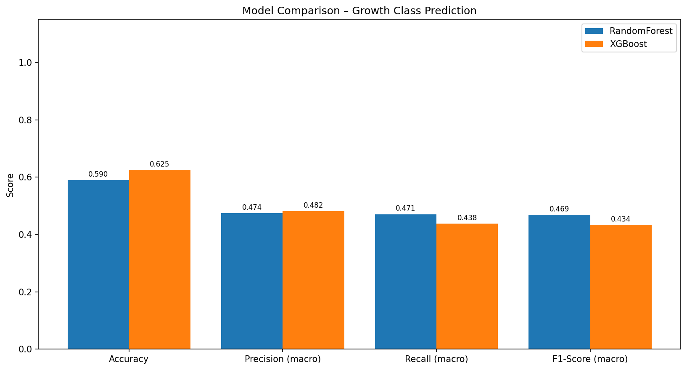


---

#### Random Forest – Raporti i klasifikimit

| Klasa | Precision | Recall | F1-Score | Support |
|-------|-----------|--------|----------|---------|
| DECLINING | 0.485 | 0.588 | 0.531 | 245 |
| GROWING | **0.706** | 0.667 | **0.686** | 465 |
| STABLE | 0.232 | 0.159 | 0.188 | 82 |
| **macro avg** | **0.474** | **0.471** | **0.469** | 792 |
| weighted avg | 0.589 | 0.590 | 0.587 | 792 |

Random Forest identifikon mirë klasën GROWING (F1=0.686) por ngatërron shpesh STABLE me DECLINING/GROWING, gjë që reflekton vështirësinë e dallimit të rritjes "margjinale" (±5%) nga lëvizjet e vërteta.

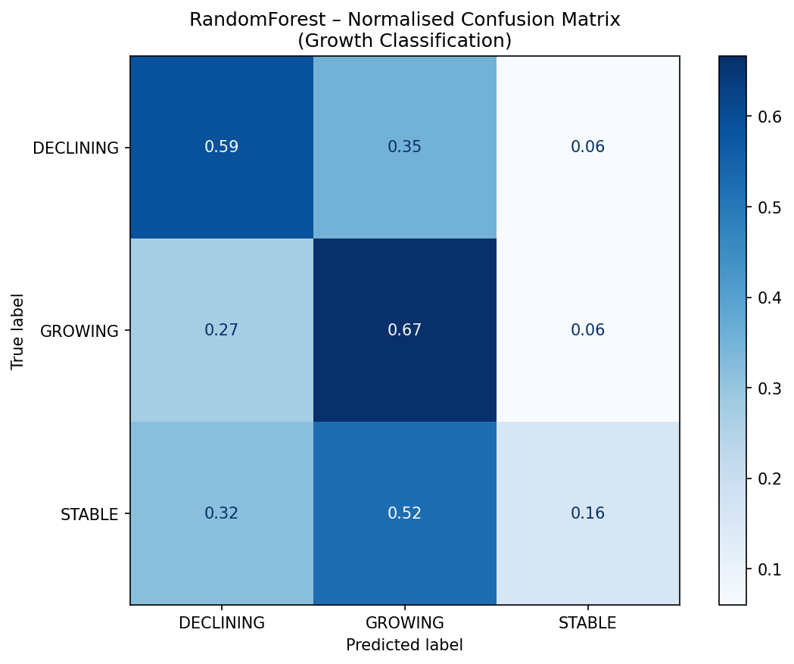

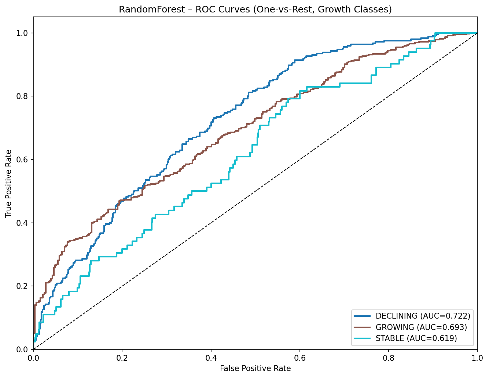

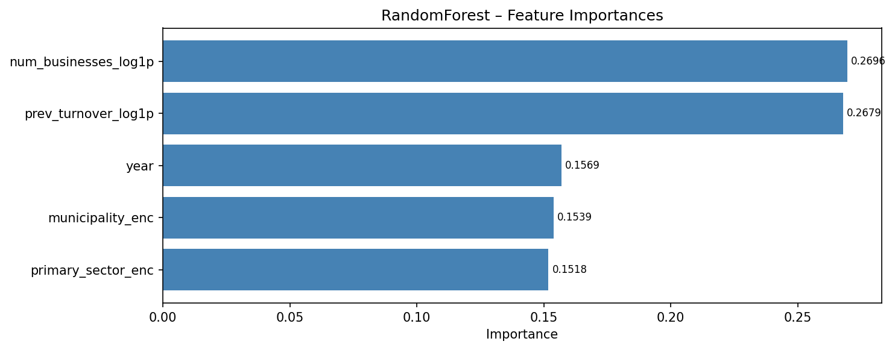

---

#### XGBoost – Raporti i klasifikimit

| Klasa | Precision | Recall | F1-Score | Support |
|-------|-----------|--------|----------|---------|
| DECLINING | 0.524 | 0.445 | 0.481 | 245 |
| GROWING | 0.673 | **0.822** | **0.740** | 465 |
| STABLE | 0.250 | 0.049 | 0.082 | 82 |
| **macro avg** | **0.482** | **0.438** | **0.434** | 792 |
| weighted avg | 0.583 | 0.625 | 0.592 | 792 |

XGBoost arrin Recall=0.822 për GROWING — domethënë kap 82% të kombinimeve (komunë, sektor) që vërtet u rritën. Megjithatë, klasa STABLE humbet gati plotësisht (Recall=0.049): modeli e grupon atë kryesisht si GROWING ose DECLINING. Kjo është e arsyeshme ekonomikisht — "stabiliteti" i vërtetë në 5 vite me rritje globale është fenomen i rrallë.

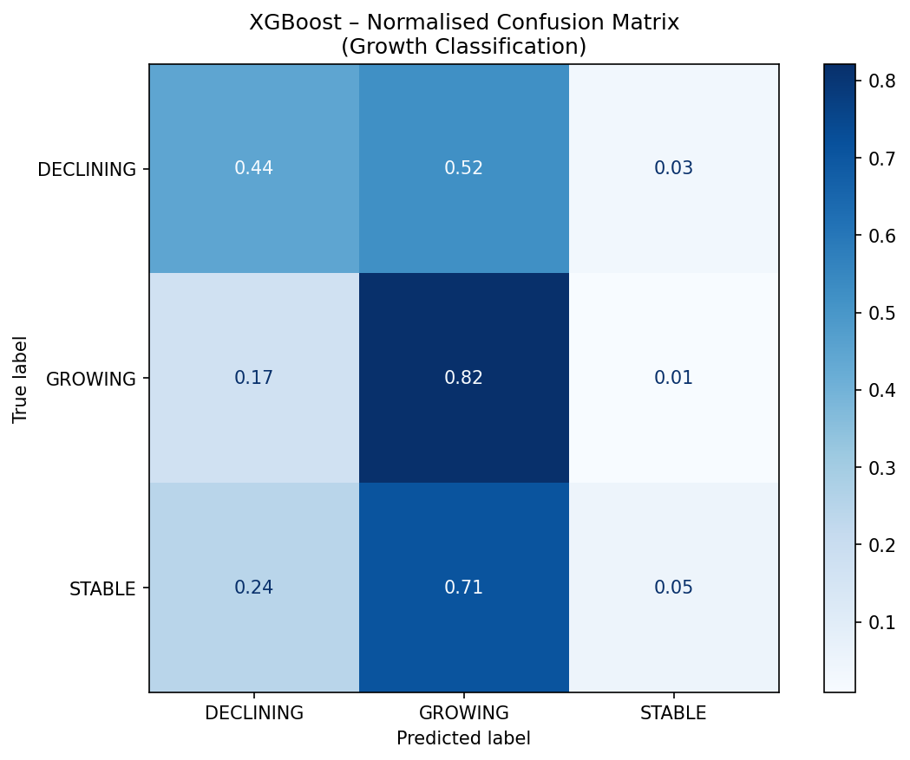

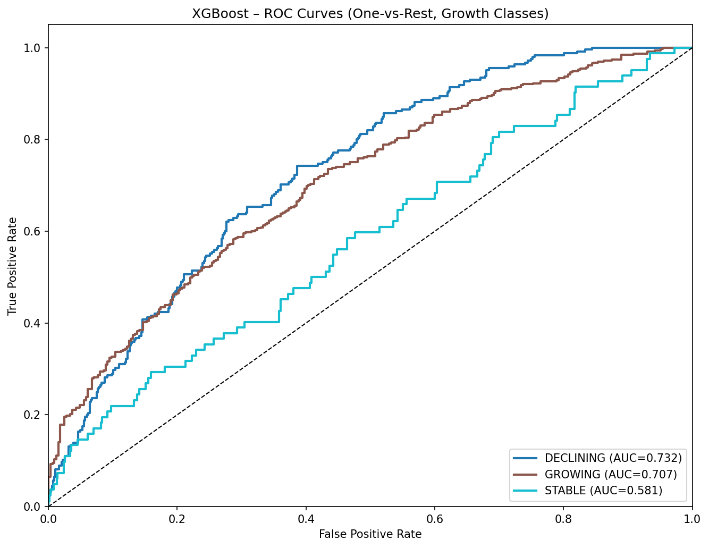

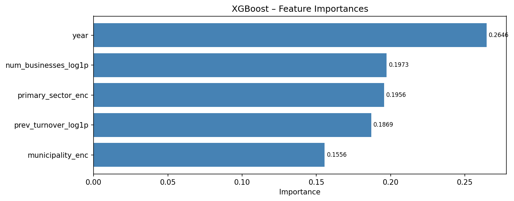

---

#### Unsupervised Learning – K-Means: analiza e klastereve

**Gjetja e k-ut optimal (k=2 deri k=8)**

| k | Inertia | Silhouette Score | Davies-Bouldin Index |
|---|---------|-----------------|----------------------|
| 2 | 14 793 | **0.2158** | 1.6670 |
| 3 | 12 716 | 0.1890 | 1.7108 |
| **4** | **11 301** | 0.1806 | 1.5839 |
| 5 | 10 137 | 0.1840 | 1.4628 |
| 6 | 9 247 | 0.1927 | 1.3844 |
| 7 | 8 609 | 0.1880 | 1.3200 |
| 8 | 7 954 | 0.1955 | **1.3682** |

U zgjodh **k=4**: elbow-i shfaqet qartë pas k=4 dhe ofron 4 profile të interpretueshme të rritjes: *rritje e fortë* / *rritje e moderuar* / *stagnacion* / *rënie*. Silhouette maksimal është në k=2 (0.2158), por k=2 është tepër i thjeshtë për analiza ekonomike kuptimplota.

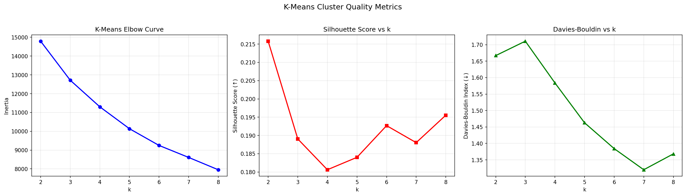

**Metrikat e modelit final K-Means (k=4)**

| Metrika | Vlera |
|---------|-------|
| Inertia | 11 301 |
| Silhouette Score | 0.181 |
| Davies-Bouldin Index | 1.584 |

---

#### Unsupervised Learning – Klasterimi i trajektoreve të rritjes

Për t'u dhënë përgjigje pyetjeve "cilat qytete ndanë të njëjtin trend rritjeje?" dhe "cilët sektorë u sjollën ngjashëm gjatë viteve?", u aplikua klasterimi K-Means (k=4) direkt mbi matricën e trajektoreve (grupi × vit → shkalla mesatare e rritjes).

**Klasterimi i komunave (Municipality Trajectory Clustering)**
- Silhouette=0.235 | Davies-Bouldin=1.143
- Komunat ndahen në 4 grupe sipas profilit të rritjes 2020–2025


**Klasterimi i sektorëve (Sector Trajectory Clustering)**
- Silhouette=0.184 | Davies-Bouldin=0.882 (ndarja e sektorëve është më e qartë se ajo e komunave)
- Sektorët ndahen sipas ritmit dhe drejtimit të rritjes vit pas viti


---

#### Unsupervised Learning – PCA

| Komponent | Varianca e Shpjeguar | Kumulative |
|-----------|---------------------|------------|
| PC1 | 39.7% | 39.7% |
| PC2 | 20.2% | **59.9%** |
| PC3–PC4 | 35.1% | 95.0%+ |

Dy komponentët e parë shpjegojnë **59.9%** të variancës — shumë më shumë se versioni i mëparshëm (39.2%), sepse dataset-i i growth-it ka tipare më kohezive. Nevojiten vetëm **4 komponentë** për ≥95%.


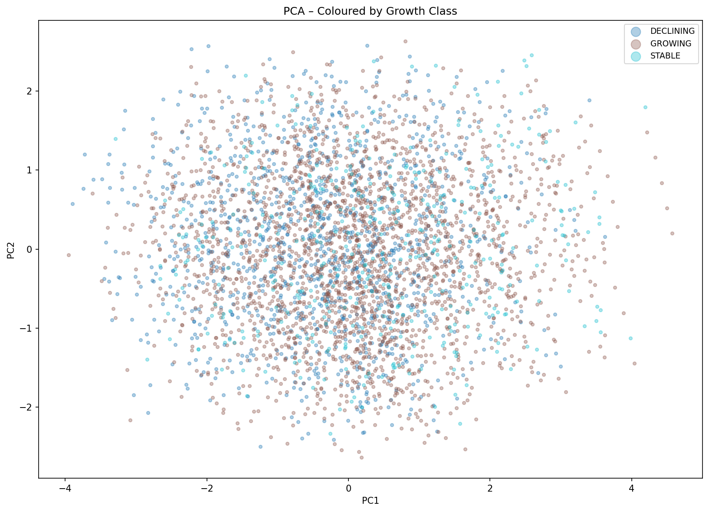


---

#### Analiza Kryqëzore: Sektor × Komunë (Heatmaps)

Kjo është analiza qendrore e Fazës 2. Çdo qelizë e heatmap-it tregon **shkallën mesatare të rritjes YoY** për atë kombinim (sektor, komunë). Ngjyra e gjelbër = rritje, e kuqe = rënie.

**Rritja sipas Komunave (Municipality × Year)**

Grafiku tregon si ka evoluuar qarkullimi i çdo komune vit pas viti. Komunat me rritje të qëndrueshme të gjelbër janë qendrat ekonomike dinamike.

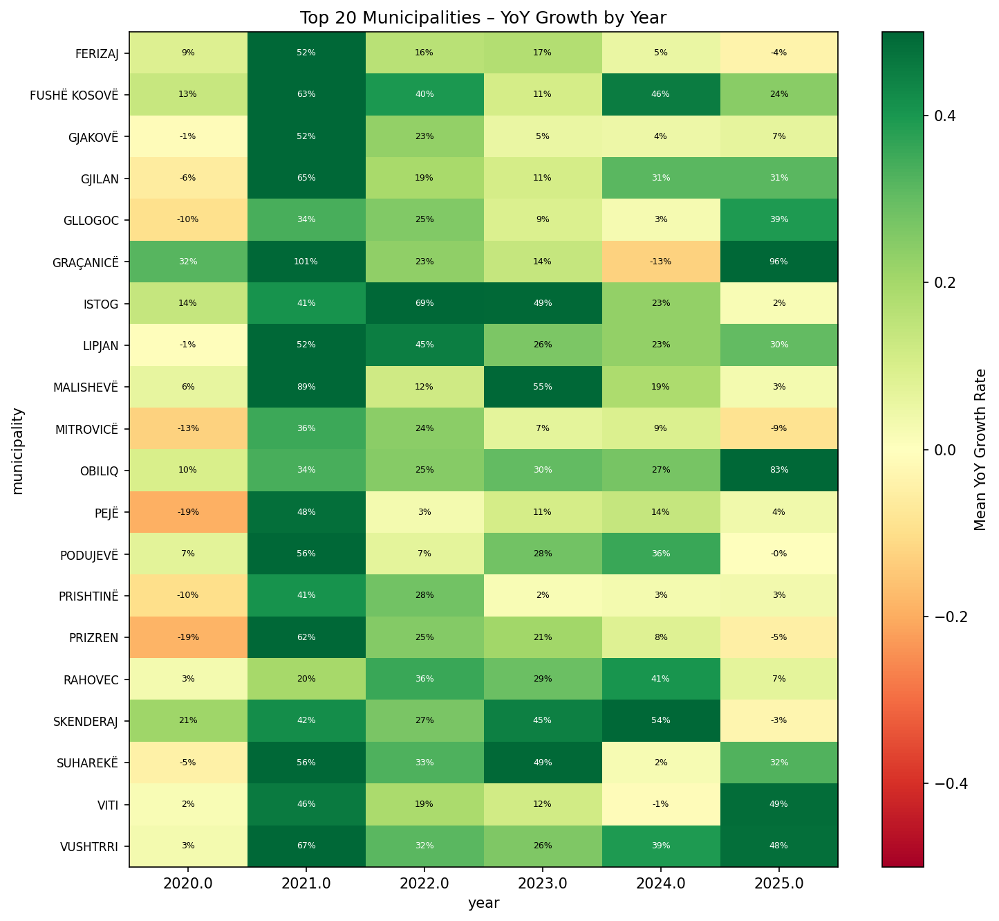

**Rritja sipas Sektorëve (Sector × Year)**

Grafiku identifikon sektorët me rritje sistemike dhe ata me tkurrje. Periudha 2020–2021 tregon impaktin e COVID-19 dhe rimëkëmbjen pasardhëse.

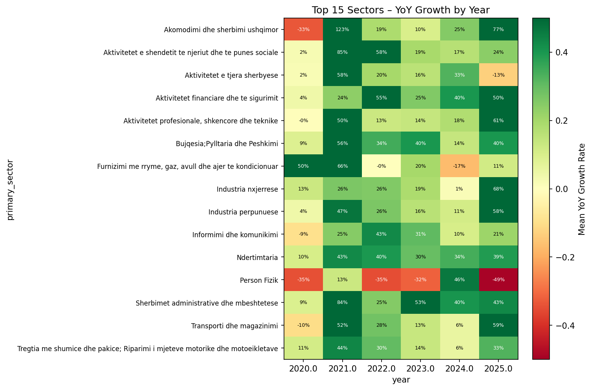

**Kryqëzimi Sektor × Komunë — të gjitha vitet**

Ky grafik u përgjigjet direkt pyetjes: *"Si ka performuar sektori X në qytetin Y krahasuar me qytetet e tjera?"*

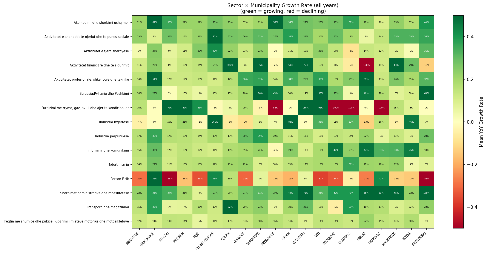

**Kryqëzimi Sektor × Komunë — 2023**

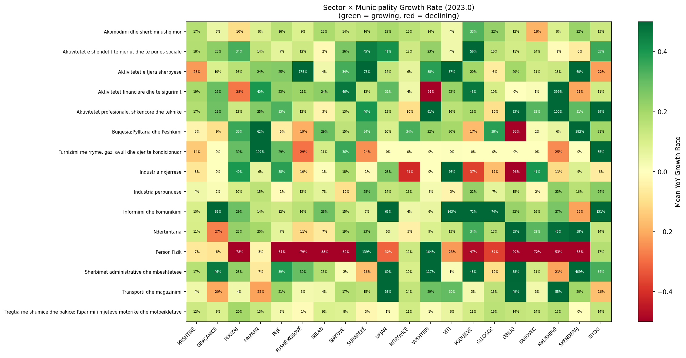

**Kryqëzimi Sektor × Komunë — 2024**

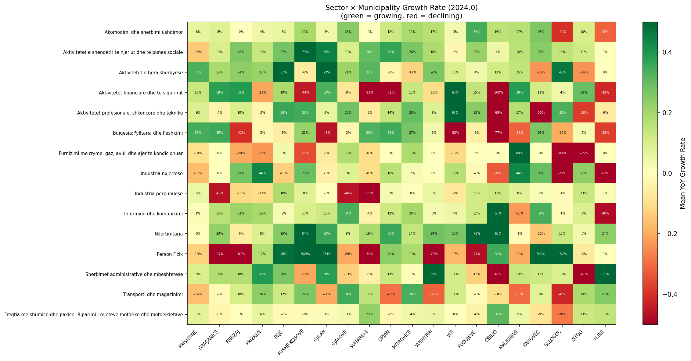

**Kryqëzimi Sektor × Komunë — 2025**

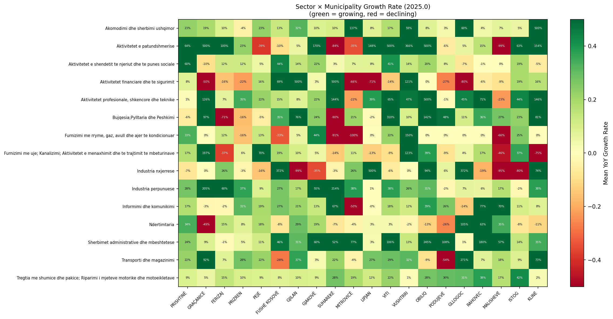

---

---

#### Supervised Learning – Regresion (Step B)

Tre modele regresioni u trajnuan mbi të njëjtat tipare si klasifikuesit (pa `growth_rate` si input — shih shënimin e leakage-ut), me target-in `growth_rate` si vlerë të vazhdueshme.

> **Train set:** 3 164 rreshta | **Test set:** 792 rreshta | Split: 80/20 pa stratifikim

##### Krahasimi i modeleve të Regresionit

| Model | MAE | RMSE | R² | Interpretim |
|-------|-----|------|----|-------------|
| **Linear Regression** | 0.5216 | 0.8605 | 0.0495 | Baseline i dobët; rritja ka pak sinjal linear |
| **Random Forest Regressor** | **0.4932** | **0.8577** | **0.0556** | ✓ Modeli më i mirë — MAE dhe RMSE më të ulëta |
| **XGBoost Regressor** | 0.5147 | 0.8931 | −0.0237 | R² negativ: performon nën mesataren e thjeshtë |

**Pse R² është i ulët (~5%)?**

R² prej 0.05–0.06 do të thotë se modelet shpjegojnë rreth **5% të variancës** të shkallës YoY të rritjes. Kjo është e pritshme dhe jo domosdoshmërisht shenjë e modelit të gabuar:

- **Rritja ekonomike varet nga faktorë makro** si politika fiskale, investimet e huaja, inflacioni dhe goditjet globale (p.sh. COVID-19, lufta në Ukrainë) — asnjë prej tyre nuk është i disponueshëm në datasetin ATK.
- **Dataset-i i vogël pas agregimit** (3 956 rreshta) e kufizon kapacitetin e modeleve jo-lineare.
- **Sinjali është më i qartë si klasifikim**: pyetja "GROWING apo DECLINING?" (59–63% accuracy) është më e saktë se parashikimi i vlerës ekzakte të `growth_rate`.

Për qëllime analitike dhe politike, **klasifikuesi rekomandohet** si modeli kryesor. Regresori shërben për renditjen relative të mundësive në parashikimet 2026.

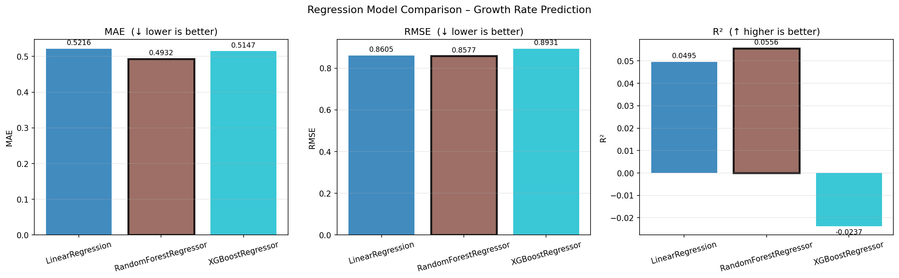

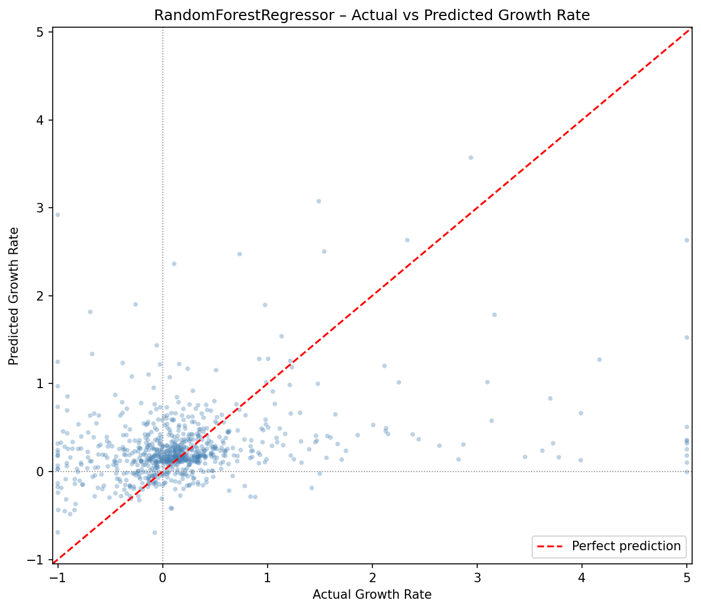

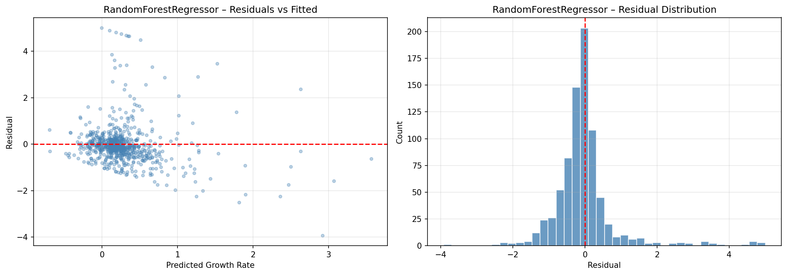

---

#### Parashikimet e Tregut 2026 (Step E)

Duke përdorur qarkullimin e vitit 2025 si "qarkullim paraprak", të 5 modelet parashikuan rritjen për **659 kombinime (komunë × sektor)** për vitin 2026.

> **Baza:** Të dhënat e 2025 → parashikim 2026 | Modeli kryesor për renditje: **XGBoost Regressor**

##### Top 10 Mundësi Rritjeje për 2026 (XGBoost Regressor)

| Komuna | Sektori | Rritja e Parashikuar |
|--------|---------|----------------------|
| SUHAREKË | Aktivitetet e pasurive të paluajtshme | +479.5% |
| GJAKOVË | Aktivitetet e pasurive të paluajtshme | +214.4% |
| FERIZAJ | Aktivitetet e pasurive të paluajtshme | +180.2% |
| MITROVICË | Aktivitetet e pasurive të paluajtshme | +142.7% |
| PRIZREN | Aktivitetet e pasurive të paluajtshme | +138.1% |
| VUSHTRRI | Aktivitetet e pasurive të paluajtshme | +135.0% |
| LIPJAN | Aktivitetet e pasurive të paluajtshme | +132.8% |
| GJILAN | Aktivitetet e pasurive të paluajtshme | +131.9% |
| DRENAS | Aktivitetet e pasurive të paluajtshme | +127.4% |
| PEJË | Aktivitetet e pasurive të paluajtshme | +122.6% |

> **Shënim interpretues**: Parashikimet ekstreme (>100%) duhet të shihen me kujdes — R² i ulët i modelit të regresionit (~5%) tregon pasiguri të lartë në vlerat absolute. Ato janë të dobishme për **renditje relative** (cilët sektorë/komuna kanë potencial më të lartë), jo si parashikime absolute numerike.

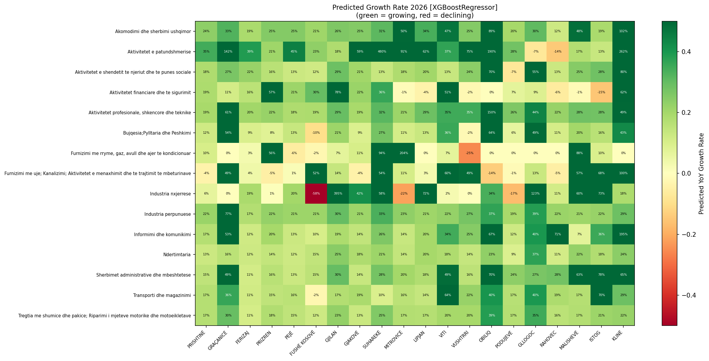

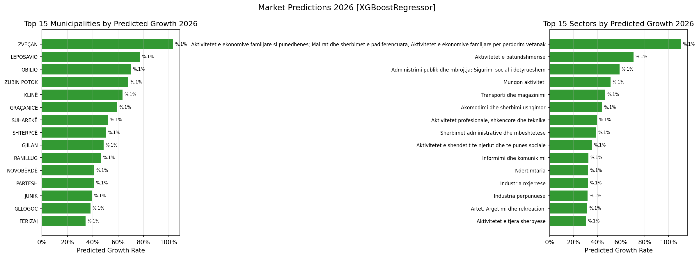

Parashikimet e plota janë të disponueshme në:
- `Faza_2/outputs/metrics/predictions_2026.csv` — 659 rreshta me parashikime nga të 5 modelet
- Kolonat: `municipality`, `primary_sector`, `growth_class_RandomForest`, `growth_class_XGBoost`, `growth_rate_LinearRegression`, `growth_rate_RandomForestRegressor`, `growth_rate_XGBoostRegressor`, `est_turnover_*`

---

### Step C: Ndikimi i Fazës 1 mbi rezultatet e modelimit

Përpunimi i Fazës 1 ka pasur ndikim të drejtpërdrejtë dhe të matshëm mbi cilësinë e analizës ekonomike në Fazën 2:

**Heqja e 102 977 duplikateve** ishte kritike: duplikatat do të kishin fryra artificialisht qarkullimin e disa kombinimeve (komunë, sektor, vit), duke falsifikuar llogaritjen e shkallës YoY të rritjes. Pas heqjes, agregimet pasqyrojnë vlerën reale ekonomike.

**Transformimi log1p i qarkullimit** ishte i domosdoshëm për dy arsye: (1) diferenca ekstreme midis komunave (Prishtina 51 miliardë EUR vs. komunat e vogla me disa miliona) do të dominonte distancat Euklidiane në K-Means pa log-transform; (2) StandardScaler funksionon mirë kur shpërndarja afron normalen — log1p e siguron këtë.

**Normalizimi NFKC i tekstit shqip** (ë, ç, karaktere speciale) parandaloi grupim të gabuar: `"Prishtinë"` vs `"Prishtine"` pa normalizim do të sillte dy komuna të ndryshme gjatë agregimt, duke fragmentuar datasetin e growth-it.

**Outlier detection (Faza 1)** zbuloi 96 473 rreshta ekstreme me IQR. Megjithëse nuk u hoqën, njohja e tyre shpjegon pse disa kombinime (komunë, sektor) kanë growth_rate të jashtëzakonshme (+200% ose −80%) — kryesisht nga biznese individuale me qarkullim shumë të lartë që hyjnë ose dalin nga tregu.

**Agregimi si zgjidhje ndaj imbalance-it**: Imbalanca origjinale e `registration_status` (SH.P.K. 49% vs KOMPANI E HUAJ 1.7%) bëhet e parëndësishme në Fazën 2 — duke agreguar mbi llojin e entitetit, njësia e analizës bëhet kombinimi (komunë, sektor) dhe jo entiteti individual. `class_weight="balanced"` trajton imbalancën e re (GROWING 58.7% / DECLINING 31% / STABLE 10.3%).

### Output-et e Fazës 2

```text
Faza_2/outputs/
├── models/
│   ├── random_forest.pkl            ← Random Forest Classifier
│   ├── xgboost.pkl                  ← XGBoost Classifier
│   ├── linear_regression.pkl        ← Linear Regression
│   ├── rf_regressor.pkl             ← Random Forest Regressor
│   └── xgb_regressor.pkl            ← XGBoost Regressor
├── metrics/
│   ├── RandomForest_classification_report.csv
│   ├── XGBoost_classification_report.csv
│   ├── model_comparison.csv
│   ├── cross_validation_results.csv        ← CV 5-fold mean±std për të dy modelet
│   ├── algorithm_verdict.csv               ← tabela e verdiktit (fitues për çdo metrikë)
│   ├── kmeans_sweep_metrics.csv
│   ├── unsupervised_metrics.csv
│   ├── municipality_growth_by_year.csv     ← rritja e çdo komune sipas vitit
│   ├── sector_growth_by_year.csv           ← rritja e çdo sektori sipas vitit
│   ├── sector_x_municipality_growth_*.csv  ← kryqëzim sektor × komunë
│   └── predictions_2026.csv               ← 659 parashikime (komunë × sektor) për 2026
└── plots/
    ├── RandomForest_confusion_matrix.png
    ├── RandomForest_roc_curves.png
    ├── RandomForest_feature_importance.png
    ├── XGBoost_confusion_matrix.png
    ├── XGBoost_roc_curves.png
    ├── XGBoost_feature_importance.png
    ├── model_comparison.png
    ├── cv_score_boxplot.png                ← shpërndarja e skoreve ndër 5 foldat
    ├── regressor_comparison.png            ← krahasim MAE/RMSE/R² i 3 regresorëve
    ├── LinearRegression_actual_vs_predicted.png
    ├── LinearRegression_residuals.png
    ├── RandomForestRegressor_actual_vs_predicted.png
    ├── RandomForestRegressor_residuals.png
    ├── XGBoostRegressor_actual_vs_predicted.png
    ├── XGBoostRegressor_residuals.png
    ├── LinearRegression_feature_importance.png
    ├── RandomForestRegressor_feature_importance.png
    ├── XGBoostRegressor_feature_importance.png
    ├── predicted_growth_2026_XGBoostRegressor.png  ← heatmap parashikimesh 2026
    ├── predicted_top_2026_XGBoostRegressor.png     ← top 15 mundësi rritjeje
    ├── kmeans_elbow_silhouette.png
    ├── municipality_trajectory_clusters.png ← komunat sipas profilit të rritjes
    ├── primary_sector_trajectory_clusters.png
    ├── pca_true_labels.png
    ├── pca_kmeans_clusters.png
    ├── pca_variance_explained.png
    ├── municipality_growth_by_year.png      ← heatmap komunë × vit
    ├── sector_growth_by_year.png            ← heatmap sektor × vit
    ├── sector_x_municipality_growth_all.png ← kryqëzim kryesor (të gjitha vitet)
    ├── sector_x_municipality_growth_2023.0.png
    ├── sector_x_municipality_growth_2024.0.png
    └── sector_x_municipality_growth_2025.0.png
```
